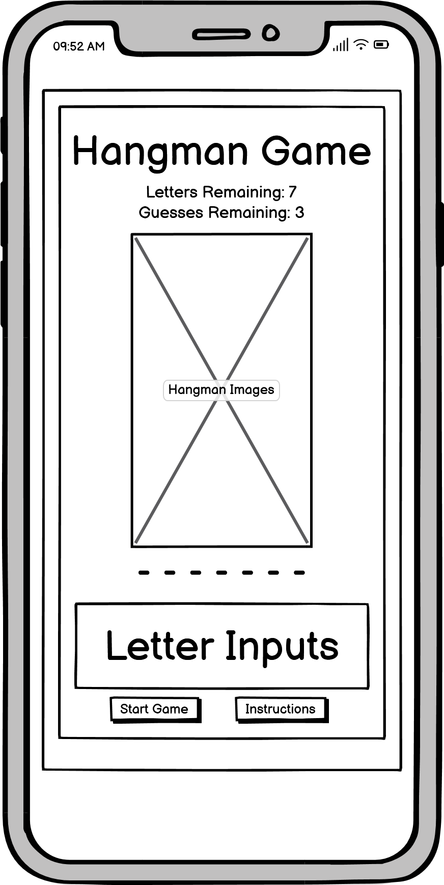

# Hangman Puzzle Game

The "Hangman Puzzle Game" is not just a game, it's a journey through the world of words and wits. Our aim is simple: to offer a modern twist on the classic Hangman game that engages players of all ages and backgrounds. No more mundane guessing games – the "Hangman Puzzle Game" transforms wordplay into an immersive experience that tests your vocabulary and quick thinking. Whether you're a wordsmith looking for a challenge or a casual gamer seeking entertainment, the "Hangman Puzzle Game" has something for everyone.

Our game is designed with accessibility and ease of use in mind. New players will be delighted to find an intuitive interface that lets them jump right into the action. It's a fresh take on a timeless game, offering a straightforward way to test your linguistic skills. But don't be fooled by its simplicity, the "Hangman Puzzle Game" is a brain-teaser that will keep you hooked for hours.

Who is the "Hangman Puzzle Game" for? Everyone! From kids honing their spelling skills to adults relaxing during a break, the "Hangman Puzzle Game" offers an inclusive gaming experience. Parents can bond with their children over word puzzles, and friends can challenge each other to see who can guess the most words. It's a game that bridges generations and creates connections through language.

[View Hangman Puzzle Game on Github Pages](https://treggs1.github.io/code-institute-project2/)

## UX

The Hangman Puzzle Game is designed for accessibility and ease of use, ensuring that both newcomers and word enthusiasts can dive right in.

### Colour Scheme

- `#0e1414` used for text, headings and borders in the game area.
- `#f2eaea` used for background colour of page.
- `#ffffff` used for background colour of game area.
- `#555555` used for background colour of popups.
- `#a9a9a9` used for letter input background colour on hover.
- `#008000` used for letter input background when correct letter is selected.
- `#ff0000` used for letter input background when incorrect letter is selected.

I used [coolors.co](https://coolors.co/0e1414-f2eaea-ffffff-a9a9a9-555555-008000-ff0000) to generate my colour palette.

### Typography

- [Oswald](https://fonts.google.com/specimen/Oswald) was used for the primary headers, titles, letter inputs and puzzle output.

- [Source Sans 3](https://fonts.google.com/specimen/Source+Sans+3) was used for all other secondary text.

- [sans-serif] was used as a backup font

## User Stories

### New Site Users

- As a new site user, I would like to understand the basic rules of the Hangman game, so that I can start playing without confusion.
- As a new site user, I would like to easily start a new game, so that I can test my word guessing skills.
- As a new site user, I would like to receive feedback when I guess a letter correctly or incorrectly, so that I can learn from my guesses.
- As a new site user, I would like to see my progress, including the number of remaining guesses and the letters I've correctly guessed, so that I can strategize my next moves.
- As a new site user, I would like to receive clear instructions on how to play the game and how to interact with the user interface.

### Returning Site Users

- As a returning site user, I would like the option to start a new game easily after completing or exiting a previous game, so that I can continue playing without interruption.
- As a returning site user, I would like to encounter new words and puzzles each time I start a game, so that I can continue to challenge myself.

## Wireframes

I've used [Balsamiq](https://balsamiq.com/wireframes) to design my site wireframes.

### Game Wireframes

| Device | Screenshot |
| --- | --- |
| Mobile |  |
| Tablet |  |
| Desktop |  |

## Structure

### Existing Features

- **Start Game Button**

    - The start button is clicked by the user to begin the game.

- **Instructions Button**

    - The instructions button is there for the user to get instructions on how to play the game if they need it. When clicked it will open a popup with the instruction.

- **Instructions popup**

    - The instructions popup contains all the information the user needs to understand how to play the game.

- **Game status feedback**

    - The game status feedback shows the user how many letters still need to be solved and how many guesses they have remaining.

- **Hangman Image**

    - The hangman image provides a visual representation of how the game is progressing.

- **Hangman puzzle output**

    - The hangman puzzle output shows a dash for each letter in the puzzle and upon a correct guess the dash is change into the correct letter.

- **Letter Inputs**

    - The letter inputs are for the user to select which letter they are guessing, if it is a correct guess the letter background will change to green and the letter will be revealed in the puzzle however, if the guess is incorrect the letter background will turn red.

- **You win popup**

    - The you win popup alerts the user that they have completed the puzzle and gives them an option of restarting the game with a new random word or exiting the popup.

- **Game over popup**

    - The game over popup alerts the user that they have run out of guesses and the game is over it also reveals the word to them and gives them the option of restarting the game with a new random word or exiting the popup.

## Tools & Technologies Used

- [HTML](https://en.wikipedia.org/wiki/HTML) used for the main site content.
- [CSS](https://en.wikipedia.org/wiki/CSS) used for the main site design and layout.
- [JavaScript](https://www.javascript.com) used for user interaction on the site.
- [Git](https://git-scm.com) used for version control. (`git add`, `git commit`, `git push`)
- [GitHub](https://github.com) used for secure online code storage.
- [GitHub Pages](https://pages.github.com) used for hosting the deployed front-end site.
- [Gitpod](https://gitpod.io) used as a cloud-based IDE for development.
- [JSHint](https://jshint.com/) - used to validate JS code.
- [W3 HTML validator](https://validator.w3.org/nu/) - used to validate HTML.
- [W3 Jigsaw](https://jigsaw.w3.org/css-validator/validator) - used to validate CSS.
- [AmIResponsive?](https://ui.dev/amiresponsive?url=https://treggs1.github.io/code-institute-project2/) - used to create AmIResponsive image for README.md
- [Tim Nelson's Markdown Builder](https://traveltimn.github.io/markdown-builder/) to help create the structure and some of the content for the README and TESTING.md files.
- [Coolors](https://coolors.co/) - used to generate a color palette for the site.
- [Balsamiq](https://balsamiq.com/wireframes/) - used to create wireframes during project planning.

## Testing

For all testing, please refer to the [TESTING.md](TESTING.md) file.

## Deployment

The site was deployed to GitHub Pages. The steps to deploy are as follows:
- In the [GitHub repository](https://github.com/treggs1/code-institute-project2), navigate to the Settings tab 
- From the source section drop-down menu, select the **Main** Branch, then click "Save".
- The page will be automatically refreshed with a detailed ribbon display to indicate the successful deployment.

The live link can be found [here](https://treggs1.github.io/code-institute-project2)

### Local Deployment

This project can be cloned or forked in order to make a local copy on your own system.

#### Cloning

You can clone the repository by following these steps:

1. Go to the [GitHub repository](https://github.com/treggs1/code-institute-project2) 
2. Locate the Code button above the list of files and click it 
3. Select if you prefer to clone using HTTPS, SSH, or GitHub CLI and click the copy button to copy the URL to your clipboard
4. Open Git Bash or Terminal
5. Change the current working directory to the one where you want the cloned directory
6. In your IDE Terminal, type the following command to clone my repository:
	- `git clone https://github.com/treggs1/code-institute-project2.git`
7. Press Enter to create your local clone.

Alternatively, if using Gitpod, you can click below to create your own workspace using this repository.

Please note that in order to directly open the project in Gitpod, you need to have the browser extension installed.
A tutorial on how to do that can be found [here](https://www.gitpod.io/docs/configure/user-settings/browser-extension).

#### Forking

By forking the GitHub Repository, we make a copy of the original repository on our GitHub account to view and/or make changes without affecting the original owner's repository.
You can fork this repository by using the following steps:

1. Log in to GitHub and locate the [GitHub Repository](https://github.com/treggs1/code-institute-project2)
2. At the top of the Repository (not top of page) just above the "Settings" Button on the menu, locate the "Fork" Button.
3. Once clicked, you should now have a copy of the original repository in your own GitHub account!

## Credits

### Content

| Source | Location | Notes |
| --- | --- | --- |
| [Markdown Builder](https://traveltimn.github.io/markdown-builder) | README and TESTING | tool to help generate the Markdown files | 

### Media

| Source | Location | Type | Notes |
| --- | --- | --- | --- |
| [Pexels](https://www.pexels.com) | entire site | image | favicon on all pages |
| [Lorem Picsum](https://picsum.photos) | home page | image | hero image background |

### Acknowledgements

- Cohort Facilitator - [Iris Smok](https://ie.linkedin.com/in/irissmok) for keeping tabs on me and helping with the course. 
- I would like to thank my Code Institute mentor, [Anthony Ugwu](https://code-institute-room.slack.com/team/U023K8BPH8W) for looking over my project before submission and sending README.md samples to look at.
- [@Tarah Waters](https://code-institute-room.slack.com/team/U04AFFQCEAU) for help with testing on iPhone, an example of a good README.md and encouragement.