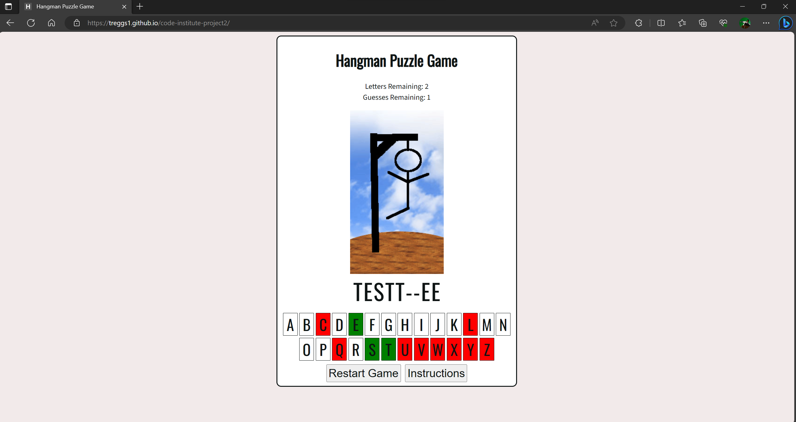

# Testing

Return back to the [README.md](README.md) file.

In this section, I will present proof to demonstrate that:
- The project **features** work as intended
- The **users** can achieve their goals
- The project is **responsive** across different devices and screen sizes
- The project is **compatible** across different web browsers
- The project uses **valid code** according to standard practice
- The project passes audits for **performance, accessibility, best practices and SEO** (using Lighthouse by Chrome Developer Tools)

## Code Validation

I will use this space to discuss code validation of my code files (where applicable).

### HTML

I have used the recommended [HTML W3C Validator](https://validator.w3.org) to validate all of my HTML files.

| Page | W3C URL | Screenshot | Notes |
| --- | --- | --- | --- |
| Home | [W3C](https://validator.w3.org/nu/?doc=https%3A%2F%2Ftreggs1.github.io%2Fcode-institute-project2%2Findex.html) |  | Pass: No Errors |

### CSS

I have used the recommended [CSS Jigsaw Validator](https://jigsaw.w3.org/css-validator) to validate all of my CSS files.

| File | Jigsaw URL | Screenshot | Notes |
| --- | --- | --- | --- |
| style.css | [Jigsaw](https://jigsaw.w3.org/css-validator/validator?uri=https%3A%2F%2Ftreggs1.github.io%2Fcode-institute-project2) |  | Pass: No Errors |

### JavaScript

I have used the recommended [JShint Validator](https://jshint.com) to validate all of my JS files and also [Esprima](https://esprima.org/demo/validate.html) to check for any syntax errors.

| File | Validator Tool |Screenshot | Notes |
| --- | --- | --- | --- |
| script.js | [JSHint](https://jshint.com/) | | Pass: no errors |
| script.js | [Esprima](https://esprima.org/demo/validate.html)  |  | Pass: No Errors |

## Browser Compatibility

I've tested my deployed project on multiple browsers to check for compatibility issues.

| Browser | Screenshot | Notes |
| --- | --- | --- |
| Chrome |  | Works as expected |
| Firefox |  | Works as expected |
| Edge |  | Works as expected |

## Responsiveness

I've tested my deployed project on multiple devices to check for responsiveness issues.

| Device | Screenshot | Notes |
| --- | --- | --- |
| Mobile (DevTools) |  | Works as expected |
| Tablet (DevTools) |  | Works as expected |
| Desktop |  | Works as expected |
| Asus ROG Phone 5 (Android) |  | Works as expected |

## Lighthouse Audit

I've tested my deployed project using the Lighthouse Audit tool to check for any major issues.

| Page | Size | Screenshot | Notes |
| --- | --- | --- | --- |
| Home | Mobile |  | 1 warning for images with low resolution and PWA warnings |
| Home | Desktop |  | Only PWA warnings |

## Defensive Programming

Defensive programming was manually tested with the below user acceptance testing:

| Page | User Action | Expected Result | Pass/Fail | Comments |
| --- | --- | --- | --- | --- |
| Home Page | | | | |
| | Click on Start Game | Starts game generates puzzle output and activates event listeners on letter inputs | Pass | |
| | Click on Restart Game | Selects random word from array, resets variables to default, removes and reactivates event listeners on letter inputs and resets letter input styles to default | Pass | |
| | Click Instructions | Brings up instructions popup for the user to read instructions | Pass | User will have the option to click Exit and close the popup |
| | Click Exit on instructions popup | Closes instructions popup and allows user to continue playing the game | Pass | |
| | Click on letter not in current puzzle | Letter background is changed to red, event listener is removed form that letter, 1 is deducted from guesses remaining and hangman image progresses to next step | Pass | |
| | Click on letter in current puzzle | Letter background is changed to green, event listener is removed from that letter, letter is reavealed in the correect position or positions if more than one occurence in current puzzle and 1 is deducted for each itteration of that letter in the current puzzle | Pass | |
| | Guesses Remaining reaches 0 before puzzle is solved | Hangman image will be at the final stage, game over popup will appear and all letter event listeners are removed | Pass | User will have the option of clicking New Game or Exit on the popup |
| | Game over popup click on New Game | Closes the game over popup, selects random word from array, resets variables to default, removes and reactivates event listeners on letter inputs and resets letter input styles to default | Pass | |
| | Game over popup click on Exit | Closes game over popup and allows user to review the current state of the game | Pass |  |
| | Letters Remaining reaches 0 and the puzzle is solved | You Win popup will appear and all letter event listeners are removed | Pass | User will have the option of clicking New Game or Exit on the popup |
| | You win popup click on New Game | Closes the you win popup, selects random word from array, resets variables to default, removes and reactivates event listeners on letter inputs and resets letter input styles to default | Pass | |
| | You win popup click on Exit | Closes you win popup and allows user to review the current state of the game | Pass |  |

## User Story Testing

⚠️⚠️⚠️⚠️⚠️ START OF NOTES (to be deleted) ⚠️⚠️⚠️⚠️⚠️

Testing user stories is actually quite simple, once you've already got the stories defined on your README.

Most of your project's **features** should already align with the **user stories**,
so this should as simple as creating a table with the user story, matching with the re-used screenshot
from the respective feature.

🛑🛑🛑🛑🛑 END OF NOTES (to be deleted) 🛑🛑🛑🛑🛑

| User Story | Screenshot |
| --- | --- |
| As a new site user, I would like to ____________, so that I can ____________. |  |
| As a new site user, I would like to ____________, so that I can ____________. |  |
| As a new site user, I would like to ____________, so that I can ____________. |  |
| As a returning site user, I would like to ____________, so that I can ____________. |  |
| As a returning site user, I would like to ____________, so that I can ____________. |  |
| As a returning site user, I would like to ____________, so that I can ____________. |  |
| As a site administrator, I should be able to ____________, so that I can ____________. |  |
| As a site administrator, I should be able to ____________, so that I can ____________. |  |
| As a site administrator, I should be able to ____________, so that I can ____________. |  |
| repeat for all remaining user stories | x |

## Bugs

- The only real issue I had was at first when the event listeners on the letters would multiply every time I restarted the game. So, let's say I restarted the game once and clicked a correct letter. It appeared in the puzzle one time, but it would remove two from the letters remaining. If it was incorrect, it would remove two from the guesses remaining, ending the game prematurely. This effect would multiply every time I restarted the game.

This took a lot of figuring out, and there wasn't a single resource I could find to solve the issue. I had to piece it together from reading multiple posts on stackoverflow.com. The most helpful post was https://stackoverflow.com/questions/69242724/remove-event-listeners-with-extra-arguments. I also used a book called 'JavaScript Beginner To Professional,' published by Packt, and developer.mozilla.org to help me understand some of the syntax I was unfamiliar with.

Through this process, I learned how to create an event handler function to generate an array that could later be iterated through to remove the event listeners. This approach also made it easier to remove the event listener from specific letters when they were clicked, preventing them from being clicked again and disrupting the game variables, which would otherwise lead to an early end of the game.